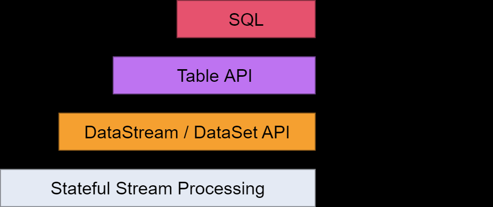

# Apache Flink

Reference: <https://flink.apache.org/>

## Concepts

1. What is Apache Flink?

1. What are the use cases of Flink?

1. What are the optimisations Flink has for bounded data streams?

1. What layers of APIs does Flink have?

   <https://ci.apache.org/projects/flink/flink-docs-stable/concepts/index.html#flinks-apis>

   

1. What is exactly-once state consistency?

1. What is an operator in Flink?

1. How does Flink handle states?

   "Flink's operations can be stateful". State is always stored locally in an instance, rather than globally across the cluster. "Each parallel instance is responsible for handling events for a specific group of keys, and the state for those keys is kept locally".

   State is kept on the JVM heap or in on-disk data structures (this is not persistence) when it is too large.

1. How does Flink handle late data?

1. What is stateful functions?

1. How does Flink handle failures?

   Flink captures asynchronous snapshots of the entire state of the distributed pipeline.

1. What notions of time (e.g. event time and processing time) does Flink support?

   Flink supports three notions of time: event time, ingestion time and processing time.

## DataStream API

1. What can be streamed?

   In `DataStream<T>`, `T` can be anything Java can serialise.
   
   Flink has its own serializer which is used for basic types (`String`, `Boolean`, `Integer`, `Long` and `Array`) and composite types (Flink's own `Tuple0` - `Tuple25` and [POJOs](file:///C:/Users/ws/Downloads/apache_flink_doc/ci.apache.org/projects/flink/flink-docs-release-1.12/learn-flink/datastream_api.html#pojos)).

   For other types, Flink falls back to use Kryo. You can use other serializers such as Avro.

1. Why does it need to be serializable to be streamable?

   Because Flink needs to distribute the stream data and also snapshot the entire state of the distributed pipeline for failure recovery.

## Operations

1. What Java versions does Flink requires?

   Java 8 or 11.

1. How to start a Flink cluster?

   `./bin/start-cluster.sh`.

1. Does Flink have a Web UI?

   Yes. By default, the WebUI of a Flink cluster is exposed at <http://localhost:8081/>.

1. Does Flink have a REST API?

   Yes. By default, the API is exposed at <http://localhost:8081/> as well. For example, <http://localhost:8081/jobs> list all the jobs.

1. How to run a Flink program?