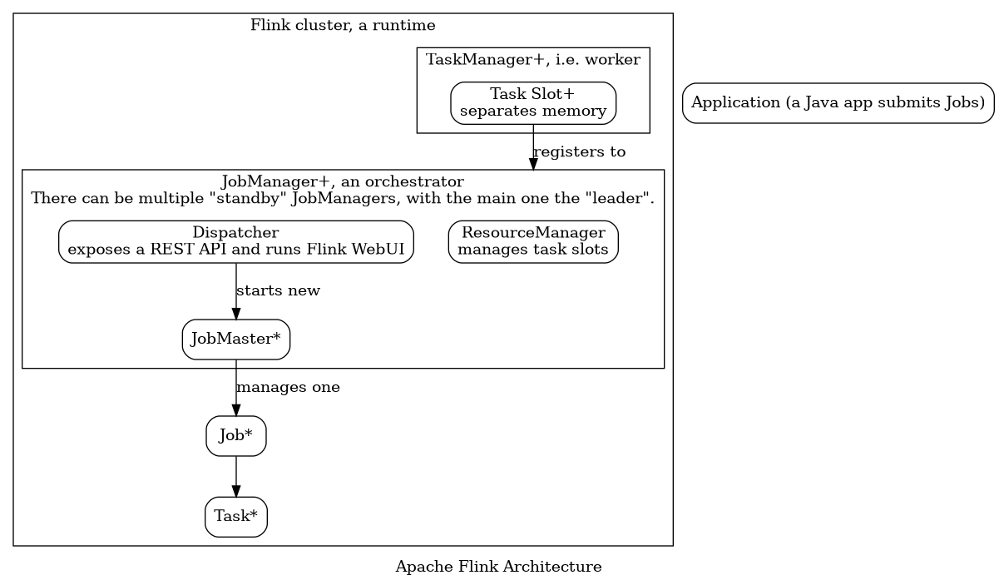

# Apache Flink

Hi \ how are you?

Hi \\ how are you?

Reference: <https://flink.apache.org/>

## Concepts

1. What is Apache Flink?

   Apache Flink is a stream processing framework that can be:

   1. distributed
   1. stateful

1. What are the use cases of Flink?

1. What are the optimisations Flink has for bounded data streams?

1. What layers of APIs does Flink have?

   Reference: <https://ci.apache.org/projects/flink/flink-docs-stable/concepts/index.html#flinks-apis>

   

   Flink has four layers of API (from low to high):

   1. Stateful Stream Processing. It is embedded into the `DataStream` API via `ProcessFunction`s. It offers stateful and timely stream processing.
   1. `DataStream`/`DataSet` API. `DataStream` API works on both bounded and unbounded streams and `DataSet` API works on only bounded streams.
   1. Table API. A declarative DSL centered around tables. A table has a schema.
   1. SQL. Similar to the Table API but supports SQL syntax.
   
   Each layer of API works on top of and interacts with the lower level API.

1. What is exactly-once state consistency?

1. What is an operator in Flink?
   
   Reference: <https://ci.apache.org/projects/flink/flink-docs-stable/dev/stream/operators/index.html>

   Operators transform one or more DataStreams into a new DataStream. For example, `map`, `filter`, `keyBy`, `process` and `reduce`.
   
   Inside an operator, you need to give a user-defined function. For example:

   ```
   data.map(new MapFunction<String, Integer> () {
       public Integer map(String value) { return Integer.parseInt(value); }
   });
   ```
   
   or with Java 8 Lambdas: `data.filter(s -> s.startsWith("http://"));`.

1. What is a Flink logical graph/dataflow graph/job graph?
   
   The three names are referring to the same thing. It is a directed graph of operators. The edges indicate the data flow between nodes (operators).

1. What is a physical graph/execution graph?

   A physical graph is derived from a logical graph for execution in a distributed runtime. Instead of operators, the nodes are Flink tasks. You can think of a logical graph as a conceptual definition, and the physical graph is a concrete execution plan with things like parallelism and resource allocation considered.

1. What is a Flink job?

   A Flink job is a runtime representation of a logical graph.

1. What is a Flink application?

   A Java application that submits jobs. Submitting jobs is usually done by calling `execute()` on an execution environment.

1. How does Flink handle states?

   "Flink's operations can be stateful". State is always stored locally in an instance, rather than globally across the cluster. "Each parallel instance is responsible for handling events for a specific group of keys, and the state for those keys is kept locally".

   State is kept on the JVM heap or in on-disk data structures (this is not persistence) when it is too large.

1. What is stateful functions?

1. How does Flink handle failures?

   Flink captures asynchronous snapshots of the entire state of the distributed pipeline.

1. What notions of time (e.g. event time and processing time) does Flink support?

   Flink supports three notions of time: event time, ingestion time and processing time.

1. What is a watermark in Flink?

   If an event **e** arrives at time **t** and denote the watermark for time **t** as **t<sub>w</sub>** (**t<sub>w</sub>** ≥ **t**). Any event with an event time (the actual the event happens) earlier than **t** but arrives later than **t<sub>w</sub>** is a late event. Flink waits until **t<sub>w</sub>** to ensure ordered processing.

1. How does Flink handle late data?

## Architecture and deployment




1. What is a standalone Flink cluster?

   A standalone Flink cluster **without a resource provider** (e.g. Kubernetes, YARN and Mesos). Flink manages the cluster itself directly in this mode.

1. What is a resource provider?

   Flink can be deployed through different resource provider frameworks, such as Kubernetes, YARN or Mesos.

1. What is a high availability service provider?

   With a high availability service provider (e.g. Zookeeper, Kubernetes HA), Flink can recover from JobManager faults. It can have multiple standby JobManagers to failover faster.

1. What are deployment modes?

   

   Depending on which component submits jobs, how many jobs a JobManager handles and how long a JobManager lives, there are three deployment modes.
   
   Note that the concept of these nodes are different from whether it is a standalone cluster or not although the per-job mode is not supported by a standalone cluster.

   1. Application mode
   
      In this mode, there is no client, so the Flink Application (whichever component creates and submits jobs) is on the cluster itself. The whole cluster is created for this application and torn down when the application finishes.
   
   1. Per-job mode
   
      In this mode, there is a client Flink Application. A new cluster is created for each job and torn down when the job is finished.
   
   1. Session mode
   
      In this mode, the Flink cluster is not bound to an application or job. The cluster's resources are used by all Flink applications and jobs.
   
   These modes have different implications of cluster lifecycle (thus affecting the cluster initialisation and termination time), resource isolation (thus affecting the performance and failover).

## DataStream API

1. What can be streamed?

   In `DataStream<T>`, `T` can be anything Java can serialise.
   
   Flink has its own serializer which is used for basic types (`String`, `Boolean`, `Integer`, `Long` and `Array`) and composite types (Flink's own `Tuple0` - `Tuple25` and [POJOs](file:///C:/Users/ws/Downloads/apache_flink_doc/ci.apache.org/projects/flink/flink-docs-release-1.12/learn-flink/datastream_api.html#pojos)).

   For other types, Flink falls back to use Kryo. You can use other serializers such as Avro.

1. Why does it need to be serializable to be streamable?

   Because Flink needs to distribute the stream data and also snapshot the entire state of the distributed pipeline for failure recovery.

## Operations

1. What Java versions does Flink requires?

   Java 8 or 11. If you like This and 

1. How to start a Flink cluster and run a Flink application (to create and submit jobs)?

   | Resource provider ↓ Deployment mode → | Application | Per-job | Session |
   | --- | --- | --- | --- |
   | Standalone cluster | Put Flink Application jar in classpath, one way: `cp ./examples/streaming/TopSpeedWindowing.jar lib/`; launch JobManager: `./bin/standalone-job.sh start --job-classname org.apache.flink.streaming.examples.windowing.TopSpeedWindowing`; start TaskManager: `./bin/taskmanager.sh start`; stop: `./bin/taskmanager.sh stop`, `./bin/standalone-job.sh stop`. | Not supported | Start cluster: `./bin/start-cluster.sh`; submit job: `./bin/flink run ./examples/streaming/TopSpeedWindowing.jar`, this starts a short-lived client Flink application. |
   | Standalone in Docker |
   | Standalone in Kubernetes |
   | Kubernetes |
   | YARN |
   | Mesos |

1. Does Flink have a Web UI?

   Yes. By default, the WebUI of a Flink cluster is exposed at <http://localhost:8081/>.

1. Does Flink have a REST API?

   Yes. By default, the API is exposed at <http://localhost:8081/> as well. For example, <http://localhost:8081/jobs> list all the jobs.
