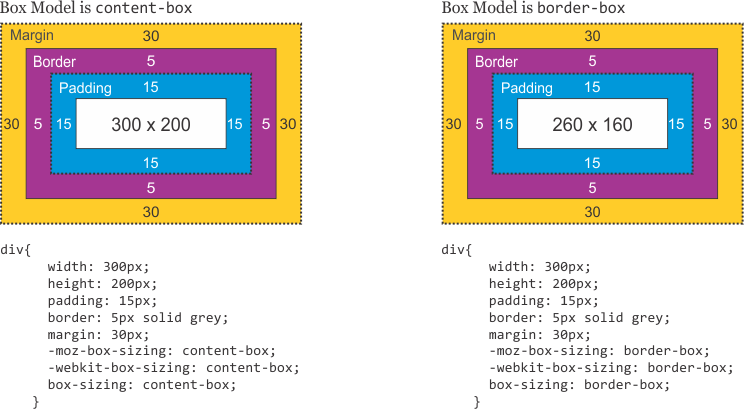

# Box 模型

Box 模型包括内容、padding、border 和 margin。

## Box Sizing

两个选项，`content-box` 和 `border-box`，默认是 `content-box`。`content-box` 时，`width` 和 `height` 指定的是内部的内容部分，不包括 padding；`border-box`时，则是包括 border在内的。只有 margin 是永远不在 box 范围内的。

下面两个的高和宽都是 100px，数据是，边框都是 10px，第一个是 `content-box`，第二个是 `border-box`，结果就是第一个中间白色部分边长是 100px，总边长是 120px，第二个总边长是 100px。

 

## `position: absolute`

配合 `position: absolute`，注意 absolute 是相对于最近的 position 不是 static（默认）的元素，所以一般就把父元素或者你想让他相对于的元素设置为 `position: relative`。可以看到相对的永远是 padding 的外框（这两个 box 都有 10px 的 padding）。

    

 

    

