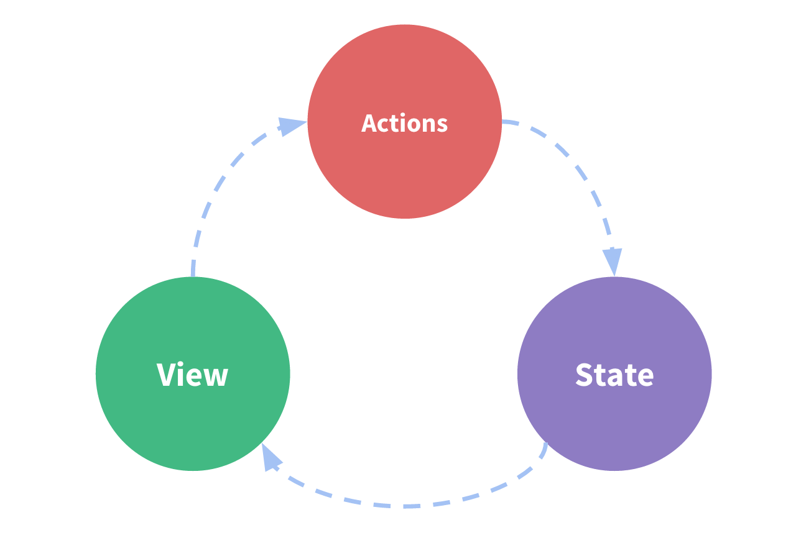

# Redux

Redux 是一个 JavaScript 的全局状态管理器。虽然主要是和 React 一起用，但只要是 JavaScript 就能用。

## 核心思想

1. 全局状态（_store_）
1. 状态是 immutable 的，只能通过 _action_ 获得新的状态
1. 这就是 _reducer_，即 `(state, action) => newState`，注意 reducer 应当是纯函数的，不要有 side effect

## Redux 相关包和工具

1. Redux Core: `redux`
1. Redux Toolkit: `@reduxjs/toolkit`
1. React-Redux: `react-redux`
1. Redux DevTools Extension： <https://github.com/zalmoxisus/redux-devtools-extension>

## [拆解正常 React 组件](https://redux.js.org/tutorials/essentials/part-1-overview-concepts#state-management)

一个常见的 React 组件有：

1. 状态
1. 视图：基于状态、声明式、UI
1. 动作：更新状态

但是当多个组件需要共享组件时，就不这么优雅了，Redux 试图使用一个全局状态来解决问题。

## 具体概念

1. `action`：有 `type` 的纯对象，`type` 是一个字符串
1. `reducer`：`(state, action) => newState`，这个名字来自于 JavaScript 的 `Array.reduce()`，必须是纯函数
1. `store`：`store.dispatch(action)`，`store.subscribe(listener)`，`store.getState()`
