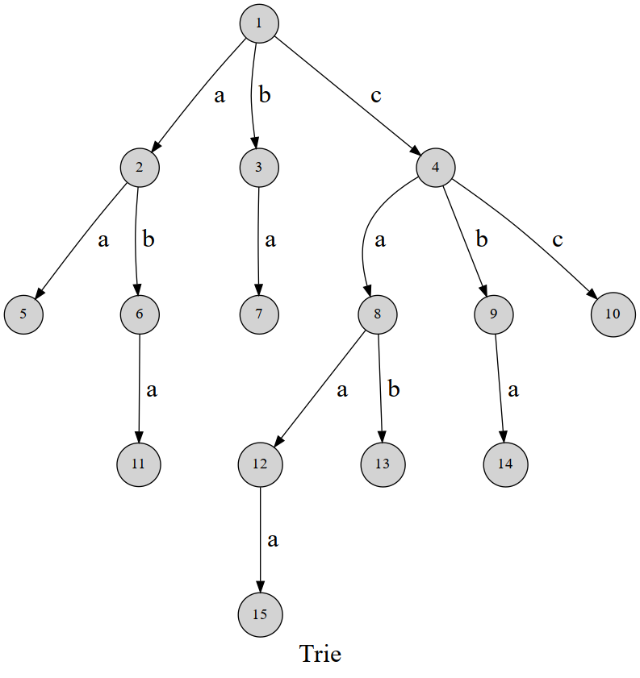

# 字符串 String

## 概念

1. 字符集 character set：字符集中的元素都可以比较大小
1. 字符串 string：S
1. 子串：S[i..j]，连着的子字符串
1. 子序列：相对顺序不变，但不用连着
1. 后缀：注意S本身也是后缀
1. 前缀：注意S本身也是前缀
1. 真后缀：非S后缀
1. 真前缀：非S前缀
1. 字典序：类似'' < a < b < ...
1. 回文串

## 匹配问题

给你一个字符串s和一组模式P，匹配s（长度为n）中的每个p（长度为m）。

1. 单模（pattern）匹配：|P| = 1
1. 多模匹配：|P| > 1
1. 匹配一直多个模式的任意后缀等

对单模匹配，暴力做法的最坏复杂度是O(mn)，最好是O(n)（每次只要比较一个字符，比如都不符合或者m = 1）。

## 哈希

> 具体来说，哈希函数最重要的性质可以概括为下面两条：
>
> 在 Hash 函数值不一样的时候，两个字符串一定不一样；
>
> 在 Hash 函数值一样的时候，两个字符串不一定一样（但有大概率一样，且我们当然希望它们总是一样的）。
>
> —— [OI Wiki](https://oi-wiki.org/string/hash/)

用字符串哈希解匹配问题的思路是依次匹配长度和pattern相等的子字符串的hash值。我们知道计算长度为n的字符串的hash值的时间为O(n)，如果每个子字符串的hash值都单独计算的话，会很慢。但是可以利用哈希算法的特性，快速计算。

方法是：

TODO

## 字典树 Trie



（图来自[OI Wiki](https://oi-wiki.org/string/trie/)）

字典树可以用来表示一些词，比如上图就可以表示：

- 5: aa
- 11: aba
- 7: ba
- 15: caaa
- 13: cab
- 14: cba
- 10: cc

当然也可以不是leaf节点，比如12表示caa。

TODO 补全

## 前缀函数

参考资料：
1. [前缀函数定义 | OI Wiki](https://oi-wiki.org/string/kmp/#_2)
1. [前缀函数、next数组和KMP | Chris - 知乎](https://zhuanlan.zhihu.com/p/348914214)

前缀函数π的意思是对一个字符串s，π(i)是对s[0...i]，如果：

1. 存在0 <= k <= i，s[0...k] == s[i - k...i]，对最大的k，π(i) = k + 1
1. 否则π(i) = 0

通过观察π(i)和π(i - 1)的关系，得到代码如下，背下来！

TODO 时间复杂度是O(n)

```python
def prefix_function(s: str) -> list[int]:
    pi = [0]
    for i in range(1, len(s)):
        j = pi[i - 1]
        while j > 0 and s[i] != s[j]:
            j -= 1
        if s[i] == s[j]:
            j += 1
        pi.append(j)

    return pi
```

## KMP算法

TODO
