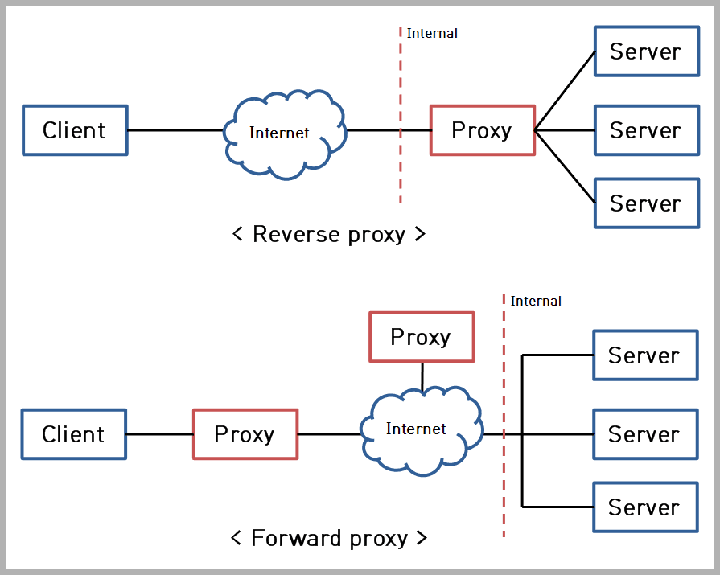

# Proxy Server

1. What is a proxy server?

    A proxy server is a server that act on behalf of a client or server.
    
    For example, a HTTP proxy server can receive HTTP requests from a HTTP client, send it to the HTTP server and send the response back to the client upon receiving the response from the HTTP server.

1. What protocols does a proxy support?

    A proxy is protocol specific. Different protocols require different implementations of the proxy.

1. What are forward proxy and reverse proxy?

1. How does a HTTP proxy server work?

[Proxy server types - Cybersecurity Guide](https://cysecguide.blogspot.com/2018/05/proxy-server-types.html)

正向代理、反向代理、透明代理、匿名代理