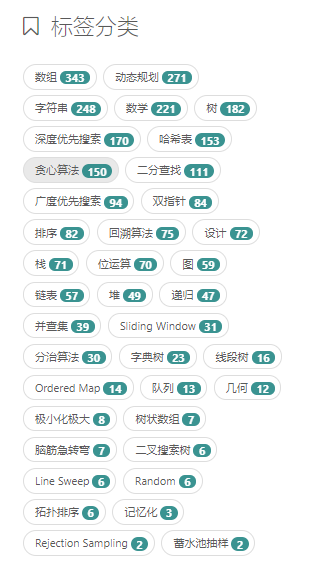

# 刷题

1. LeetCode
   1. [nonstriater / Learn-Algorithms](https://github.com/nonstriater/Learn-Algorithms)：算法学习笔记（
1. OI Wiki（7291星）

## LeetCode刷题

### 标签

| 标签 | 题数 |
| --- | --- |
| 数组 | 343 |
| 动态规划 | 271 |
| 字符串 | 248 |

### 已刷，需要回顾整理

| # | 题名 | 难度 | 标签 | 备注 |
| --- | --- | --- | --- | --- |
| 1319 | Number of Operations to Make Network Connected | 中等 | DFS、BFS、并查集 | 什么是并查集？ |

### 待刷

| # | 题名 | 难度 | 标签 | 备注 |
| --- | --- | --- | --- | --- |
| 430 | Flatten a Multilevel Doubly Linked List | 中等 | 链表、DFS | DFS要先熟悉一下。 |
| [138](https://leetcode-cn.com/problems/copy-list-with-random-pointer) | Copy List with Random Pointer | 中等 | 链表 | 图的遍历，先做了图的部分再来做。 |
